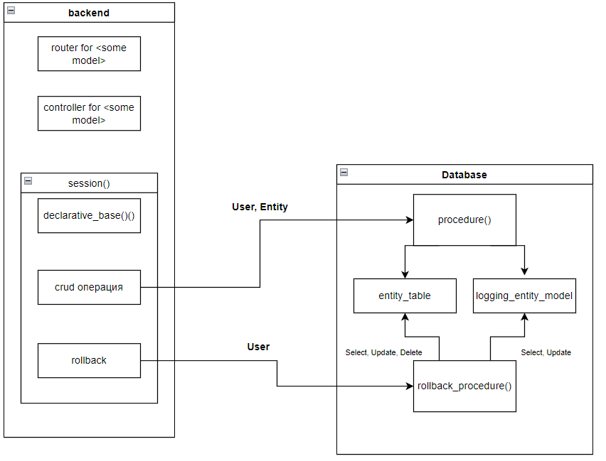
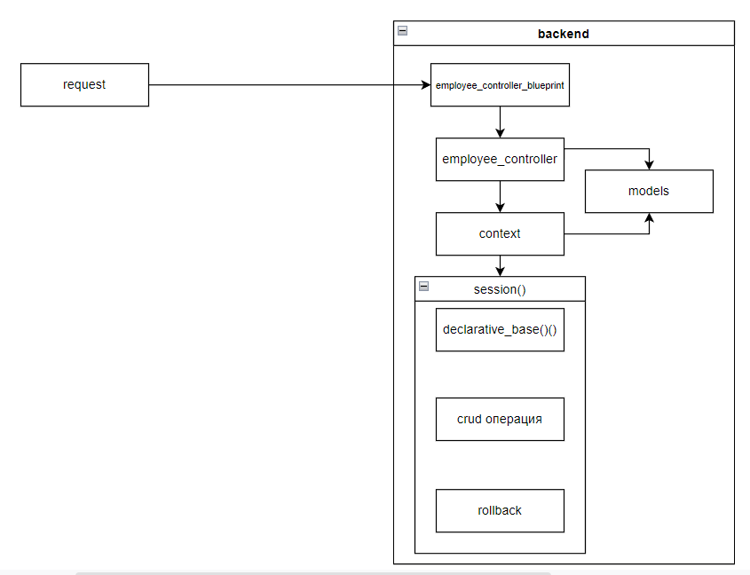
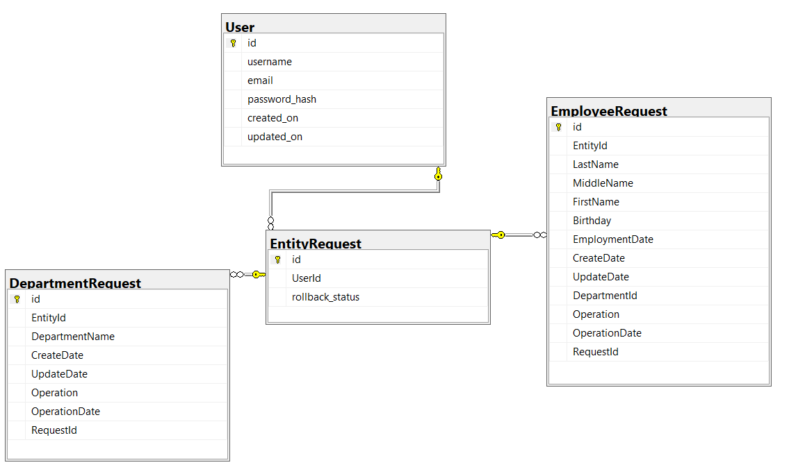
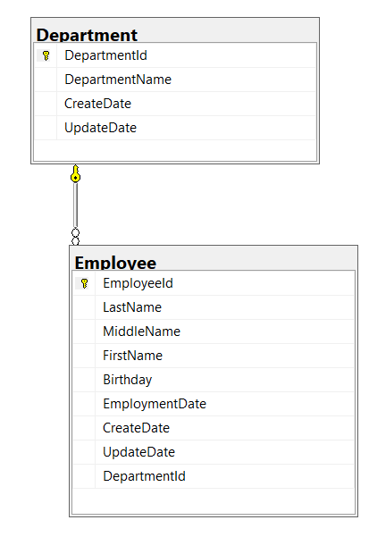
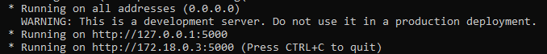

## Методология

### Часть на подумать

При взаимодействии с базой данных в бекенде можно выделить три подхода:
1. Вызов процедур в базе данных и выполнение CRUD действий через них.
2. Выполнение DML операции через запросы в коде.
3. Использование ORM.

При использовании процедур получается следующая схема:




Таким образом, мы можем логику по логгированию и откату изменения поместить в процедуры базы данных.

Плюсы подхода:
1. Бекенд не знает о таблицах, получая данные из процедуры.
2. Вся логика логгирования хранится в базе данных = не нужно рефакторить контроллер или роутер
3. Имеются механизмы для отслеживания операций вставки и обновления - триггеры.

Минусы подхода:
1. Под каждую модель необходимо будет создать процедуры получения, вставки и обновления данных.
2. Возможно, сложная логика реализации процедуры отката изменения.


Сравним второй и третий пункт.

При использовании DML операций через строковые запросы в коде нам будет тяжело унифицировать процедуры логирования и отката изменений, так как для каждой модели будет необходимо предусмотреть свою строку запроса.
Использование же ORM позволяет изменить эту ситуацию.

Плюсы подхода:
1. ORM позволяет использовать модели как классы в рамках ООП
2. Полиморфизм позволяет унифицировать операции
3. При использовании паттерна observer можно прослушивать операции над сущностями как триггеры в бд

Минусы подхода:
1. Логика логгирования в бэкенде

По сути, при использовании ORM мы можем использовать следующие алгоритмы логгирования:

1) При вставке
    1. Создание записи запроса в бд со ссылкой на пользователя
    2. Вставка данных с получением id модели
    3. Вставка данных в таблицу логгирования модели со ссылкой на id запроса и id модели

Соответственно, при откате изменений мы:
1. Читаем последний запрос пользователя (Select по последнему request_id пользователя)
2. Получаем операции из таблиц логгирования моделей
3. Удаляем записи из таблиц моделей

2) При обновлении данных
   1. Создание записи запроса в бд со ссылкой на пользователя 
   2. Получение записи, которую будем изменять
   3. Вставка данных записи до изменения в таблицу логгирования модели
   4. Обновление записи новыми данными
   
При откате изменений обновления:
   1. Читаем запись из таблицы логгирования модели
   2. Обновляем запись старыми прочитанными данными из модели

Чтобы иметь ID сущности нам необходимо сперва проводить вставку данных, а потом логирования этой операции. При update операции порядок не важен, ID уже имеется.

Имеется следующая структура вставки сущности:
1. Вставка нового запроса в бд
2. Логика по вставке в бд сущности
3. Вызов функции логирования операции.

Примером данной структуры может послужить функция context.add_employee в коде.

При откате изменений важно получить убедиться, что отката ещё не было и иметь возможность получить все операции. Благодаря внешним ключам таблиц сущностей для логирования на таблицу запросов, такая возможность есть.

Функция отката изменений имеет следующий вид:
```python
def model_rollback(Model, Model_logging, request_id):
    """
    В данной функции происходи откат изменений входной модели.
    :param Model: класс модели сущности (в данном примере это Department или Employee)
    :param Model_logging: класс модели сущности логирования (в данном примере это DepartmentRequest или EmployeeRequest)
    :param request_id: ID запроса в бд
    """
    model_requests = Model_logging.query.filter(Model_logging.RequestId == request_id).all()
    for model_request in model_requests:
        if model_request.Operation == "INSERT":
            m = Model.query.get(model_request.EntityId)
            db.session.delete(m)
        if model_request.Operation == "UPDATE":
            m = Model.query.get(model_request.EntityId)
            m.update_from_model_logging(model_request)
    db.session.commit()
```

### Часть на покодить
Мной был выбран фреймворк Flask. Подход к логированию и откатам изменений - через ORM.

Имеются следующие модули:



Логика и взаимодействие с бд убирается в модуль context.

Для логирования сущностей Department и Employee были разработаны следующие сущности:



EntityRequest - таблица запросов, включающая в себя id на пользователя.

User - таблица для хранения данных о пользователе.

DepartmentRequest - Таблица для логирования изменений в таблице Department 

EmployeeRequest - Таблица для логирования изменений в таблице Employe

Сами сущности:

~~~~

### Инструкция для запуска

Требуется установленный [docker-desktop](https://docs.docker.com/desktop/) (запускалось на Docker Desktop 4.7.0 (77141)).

Для запуска проекта необходимо создать образы docker-контейнеров, собрать и запустить. 

Для этого:
1. Клонируем проект:

`git clone https://github.com/LandaUU/flask-sqlalchemy-api.git`

2. Перемещаемся в папку проекта:

`cd ./flask-sqlalchemy-api`

3. Собираем и запускаем docker-контейнеры, описанные в файлах DockerFile и docker-compose.yml с помощью команды:

`docker-compose -f ./docker-compose.yml up --build`

При запуске вам выведется адрес для отправки запросов:



4. После того, как контейнеры проинициализировались, отправляем запрос на `/api/fill`, чтобы создать таблицы и записи в них. Сама база данных и пользователь создаются в ./mssql-docker-config/create_database.sql скрипте, выполняемом после создания контейнера.


5. Выполняем любые HTTP-запросы.

В папке ./postman имеется коллекция готовых запросов для API. 